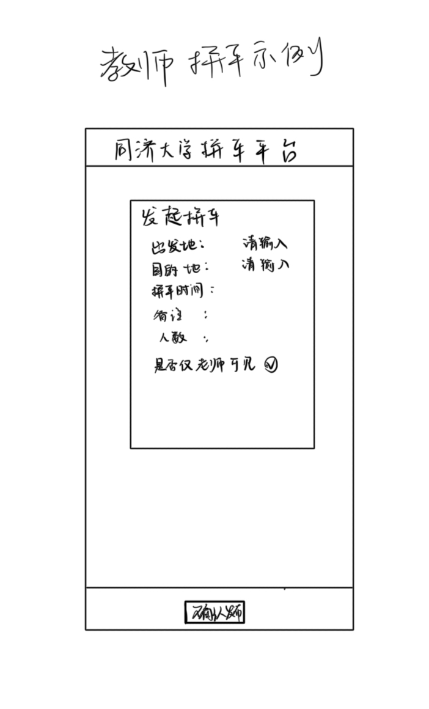
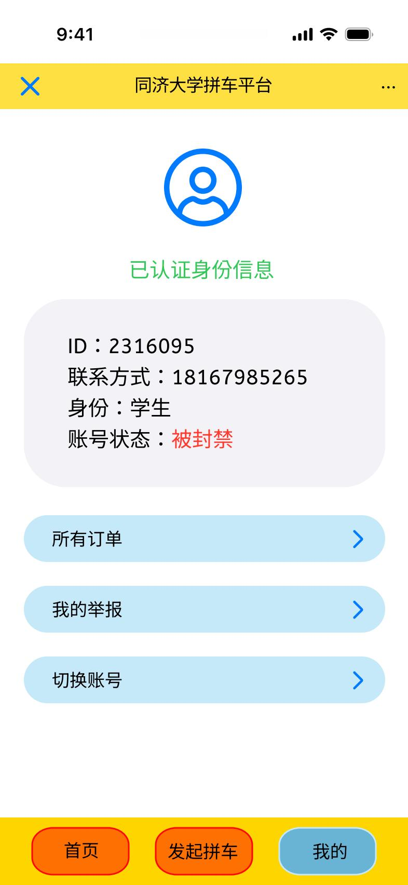
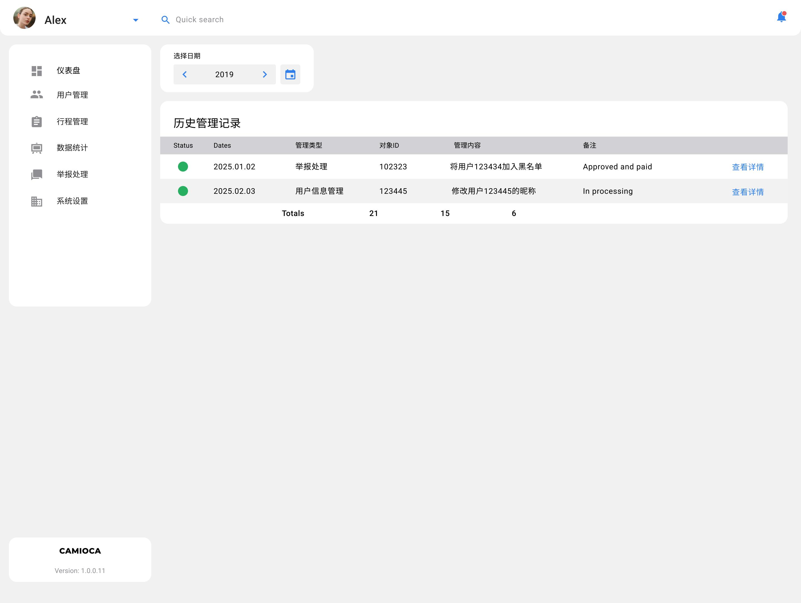

# 校园拼车小程序原型界面设计文档

> 同济大学 用户交互技术课程

---
# 一、设计准备

## 1 角色设定

| 身份   | 学生                                     | 教师                                   | 管理员                                    |
|------|----------------------------------------|--------------------------------------|----------------------------------------|
| 姓名   | Alice                                  | Robert                               | Alex                                   |
| 年龄   | 18岁                                    | 35岁                                  | 23岁                                    |
| 照片   |  |  |  |
| 角色定位 | 需要远距离打车的学生，可以参与拼车，发起拼车，一起平摊车费          | 需要拼车的教师，可以选择只与教师拼车                   | 研究生勤工俭学，做管理平台的管理员，管理拼车平台的信息，处理举报       |

## 2 内容分析

### 2.1 场景描述与需求分析

随着高校规模的不断扩大，学生和教职工在校内外的通勤、出行需求日益频繁，尤其在上下课高峰期、周末返家、课程集中教学、社团活动等时间段，出行集中、线路重合，导致打车难、等待久、信息不对称等问题突出。传统的出行方式如校车、步行、或使用社交软件临时拼车，效率低、安全性差、缺乏管理。

为了更好地服务同济大学在校学生和老师，本项目设计一款基于微信小程序的**校园拼车辅助系统**，通过“平台化、实名制、角色分明”的模式，实现以下目标：

1.提供**便捷、透明、可管理的拼车信息发布与匹配渠道**；

2.支持**老师作为车主发布行程**，并可限制拼车对象（如仅限老师）；

3.支持**学生作为乘客发起拼车请求**，并可浏览、筛选适配行程；

4.引入**管理员角色**，负责用户身份审核、举报处理、行程监管与系统维护，保障平台秩序；

5.构建一个**轻量、可信、安全的师生互助出行生态圈**。

### 2.2 调研分析

在系统设计前，团队调研了市面上多个现有的拼车与出行类平台，并结合高校实际场景进行比对，参考对象：

**哈啰顺风车**等社会拼车平台
  
* 优点：路线匹配精准、用户体量大、评价体系健全
* 缺点：不适配校园内部短途出行、实名验证针对性差、缺乏校园社交关联与管理接口

### 2.3 预期效果

根据学生、老师、管理员三类核心用户的定位与职能，平台将提供定制化的功能支持与交互界面，达到以下预期目标：

#### 学生（主要为乘客角色）

* 浏览平台发布的拼车信息，按需筛选符合条件的行程；
* 发起拼车请求，填写出发地、目的地、时间等基本信息；
* 与校内其他用户高效配对，降低出行成本；
* 实名认证机制增强安全性，避免匿名或虚假信息；
* 若遇异常行程，可一键发起举报，由平台介入处理；
* 查看自己的拼车记录、举报历史与账号状态。

#### 老师（支持作为乘客或车主）

* 自行发布拼车订单，支持自驾或平台叫车；
* 可设置“仅限老师参与”，提升安全感与舒适性；
* 查看已发布与参与行程，并对信息进行修改或撤销；
* 可使用筛选功能查看学生或其他老师发布的拼车请求；
* 同样拥有举报权限，并可查看处理进度；
* 接入身份认证系统，确保平台安全运营。

#### 管理员（后台平台监管者）

* 登录后台管理平台，查看平台运行数据、实时统计图表；
* 审核用户身份，管理账号状态（正常/封禁）；
* 查看与管理所有拼车订单，可按多维条件筛选；
* 管理举报处理流程，对违规用户执行封禁或驳回举报；
* 维护平台秩序，形成清晰的责任链与行为记录；
* 导出平台数据，为后续分析与制度建设提供支持。

## 3 功能生成——卡片用例模型
### 3.1 学生

### 3.2 教师 

### 3.3 管理员 

## 4 策划

我们选择使用 Figma 作为原型界面设计工具，主要考虑其协作性强、设计效率高、支持多人实时编辑和共享预览的特性。

所有界面元素均按照实际使用逻辑与组件交互流程进行搭建，尽可能贴近真实小程序/网页应用的界面风格。

---

# 二.设计结果

## 1 学生

### 1.1 首页模块

#### 1.1.1 未筛选拼车列表

用户初次打开小程序时，将看到全部可用拼车订单，便于快速浏览校园内的拼车信息。

#### 1.1.2 筛选功能界面

通过出发地、目的地、拼车时间等条件筛选，提高匹配效率。

#### 1.1.3 筛选结果展示

展示符合条件的订单列表，以卡片式形式排列，便于浏览和选择。

#### 1.1.4 拼车订单详情页

点击订单卡片后，进入详情页，可查看发起人、路线、备注等信息，并发起拼车请求。

#### 1.1.5 举报订单功能

如发现可疑订单，可点击“举报”，选择举报类型，并提供简要说明（30字内）。

### 1.2 发起拼车模块

#### 1.2.1 发布拼车信息

学生填写出发地、目的地、时间、人数、备注和联系方式后，提交拼车请求。

#### 1.2.2 发布成功提示

发布后展示确认界面，提示用户提交成功。

### 1.3 修改拼车模块

#### 1.3.1 修改拼车信息

对已发布订单进行修改，如时间或拼车人数等。

#### 1.3.2 修改成功提示

确认修改后展示成功界面，提示操作完成。

### 1.4 我的页面模块

#### 1.4.1 我的账户信息（已认证）

展示学生的身份信息、联系方式、账号状态，并提供功能入口（订单管理、举报记录、账号切换）。

#### 1.4.2 所有订单查看

点击“所有订单”可查看发布和参与的拼车记录。

#### 1.4.3 我的举报记录

展示用户举报记录状态，如举报成功、失败或处理中。

#### 1.4.4 被封禁账户界面

如账号被封禁，将限制使用拼车功能，提示界面如下：

#### 1.4.5 未认证身份用户界面

未完成身份认证的用户无法使用首页与发车功能，系统将提示用户完成身份认证。

## 2 老师

### 2.1 首页模块

老师用户可浏览当前所有拼车信息，并进行筛选与加入。

> 注：当订单设置为“仅限老师可见”时，只有老师账户能看到。

（参考学生端 1.1）

### 2.2 举报功能

老师也可对其他用户发起的订单进行举报。

（参考学生端 1.1.5）

### 2.3 发起拼车模块

#### 2.3.1 发布拼车信息

除常规信息外，新增“是否仅限老师用户可见”复选框，适用于教师专属拼车场景。

#### 2.3.2 发布成功提示

与学生端一致。

### 2.4 修改拼车模块

#### 2.4.1 修改订单信息

老师可修改原有拼车信息，也可修改“仅限老师可见”的选项。

#### 2.4.2 修改成功提示

### 2.5 我的页面模块

#### 2.5.1 我的账户信息（老师身份）

与学生端一致，仅身份一栏显示为“老师”，其余功能如订单管理、举报记录等保持一致。

## 3. 管理员

本部分展示的是针对同济大学拼车平台中“管理员”角色所设计的用户界面与功能模块。管理员主要负责平台的用户管理、行程管理、举报处理等工作。管理员以使用PC进行管理为主，因此设计网页版的管理平台的用户界面，整体风格统一，信息结构清晰，页面采用侧边导航栏设计，便于快速切换不同模块。

### 3.1 登录界面

管理员登录界面简洁明了，包含邮箱与密码输入框、密码复杂度提示、忘记密码链接和登录按钮。设计遵循信息安全原则，支持特殊字符与数字组合校验。

仪表盘为管理员提供平台的实时概览数据，包括：

- 实时行程数统计（可视化图表展示）
- 实时拼车人数（区分学生与教师）
- 待处理举报数量
- 实时行程管理

### 3.2 管理员信息模块

管理员信息模块支持：

- 修改管理员信息（姓名、职位、学院信息、登录信息等）
- 查看历史登录信息（登录时间、地点、在线时长）

- 查看历史管理记录

### 3.3 用户管理模块

用户管理模块支持：

- 按昵称、用户类型、学院、手机号等字段筛选与搜索用户

- 查看用户的基本信息（昵称、ID、联系方式、学院、邮箱等）
- 支持对用户信息进行修改与处理（如封禁、修改昵称等）
- 查看用户当前进行的行程和历史行程

- 查看所有用户列表
- 支持通过用户类型与用户所在学院筛选用户列表

  

### 3.4 行程管理模块

行程管理模块用于管理员查看平台所有行程的详细信息：

- 支持按行程ID、发起人、行程状态、时间、地点等多条件筛选，搜索行程

- 可查看单个行程的详细信息，包括发起人、拼车人、评价、留言等

- 支持查看所有行程列表
- 支持导出行程记录到 Excel 表格，便于数据归档和分析

### 3.5 举报处理模块

举报处理模块集中展示所有举报记录：

- 显示待处理的所有举报信息，包括举报对象、举报原因、举报发起人等
- 支持“取消举报”与“封禁账号”操作

- 可查看所有举报记录（查看举报信息与处理状态）

---

# 三、设计分析

## 1 优点

1. **角色清晰，功能划分明确**：系统根据学生、老师与管理员三种角色设计了不同权限与功能入口，增强了平台的管理性与可操作性。
2. **界面结构清晰，信息层级合理**：采用卡片式列表+详情页的展示方式，方便用户快速获取关键信息；管理员端采用侧边导航栏，提升页面跳转效率。
3. **身份认证机制保障安全**：通过强制实名认证与账户状态控制（封禁、未认证限制功能使用等），保障平台真实、可信的使用环境。
4. **举报与封禁流程闭环设计**：从用户端发起举报到管理员端处理封禁形成完整闭环，体现平台对违规行为的监管能力。
5. **老师端特权配置人性化**：针对老师身份设定“仅老师可见”拼车选项，提升同类群体匹配效率，体现用户细分设计理念。
6. **可拓展性良好**：整体界面和功能结构支持未来功能模块扩展（如增加支付功能、路径推荐等）。

## 2 缺点

1. **页面大多为静态展示，缺少动态交互设计**：当前页面多以静态信息展现为主，缺乏动效或交互反馈，整体使用体验略显呆板。后续可引入动画元素、音效提示等，提升系统活跃度。
2. **历史记录管理不足**：如举报记录、拼车记录等缺乏清晰的归档机制，容易造成数据堆积或信息冗杂。建议未来加入“按时间范围过滤”“历史自动归档”等功能。
3. **缺乏紧急联络或反馈机制**：平台暂未设计遇到突发情况时的即时联系功能，后续可考虑加入应急联系通道或车主实名认证等级提示。
4. **尚未融合地图或路径可视化组件**：当前系统未集成地图展示拼车起止点，用户需手动输入地点，影响直观性。建议后续结合高德/百度地图实现可视路径规划。

---

# 四、互评

> **评分：5.0 / 5.0**

### 评语：

本项目在校园场景下定位清晰，调研充分，能够准确抓住学生与教师群体的出行痛点，系统功能设计贴合实际需求。界面设计风格统一、美观简洁，交互逻辑清晰；不同用户角色的权限划分合理，尤其管理员端具备完善的数据查看与处理流程，提升平台安全性与可靠性。

在原型设计方面，每个模块均设有操作反馈与界面引导，用户使用门槛低，整体体验良好。希望在后续迭代中，进一步提升平台的互动性与服务能力，拓展更多智能推荐或地图联动功能，打造更完整的校园智能出行解决方案。

